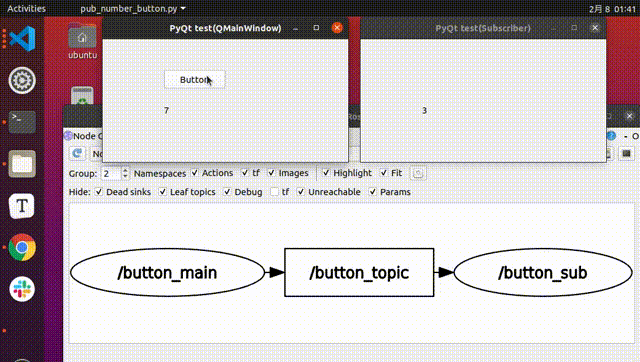

# ROS2PyQt5-example

ROS2 + PyQt5 Example



## requirements
- ROS2 (Foxy)
- PyQt5
- rclpy

## Run Example

### 01 : Simple Number

```bash
source /opt/ros/foxy/setup.bash
cd ROS2PyQt5-example
python3 01_simple_number/pub_number_button.py &
python3 01_simple_number/sub_number.py
```

> Push close button (red cross circle) to exit.


## About writer

- Ar-Ray : Japanese student.
- Blog (Japanese) : https://ar-ray.hatenablog.com/
- Twitter : https://twitter.com/Ray255Ar